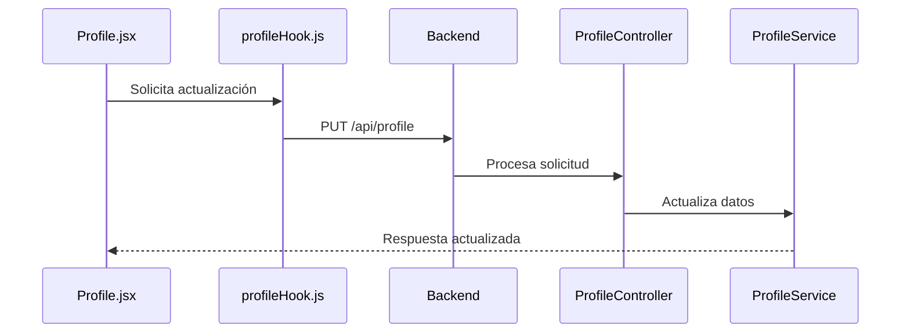
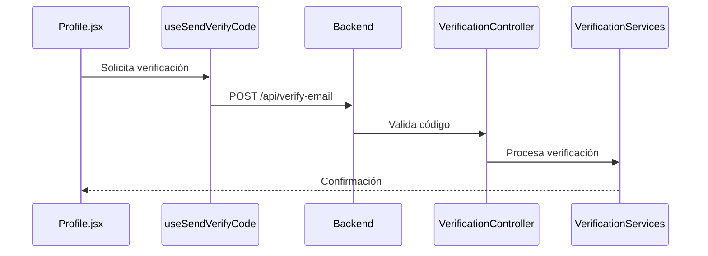
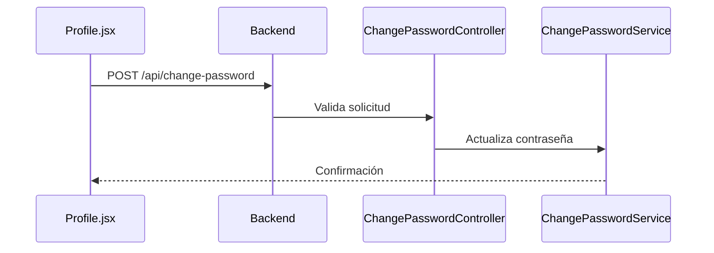

# Guía de Pruebas Frontend - Módulo 02 Users & Profiles 👥

## 1. Descripción General

Esta guía está diseñada para realizar pruebas de integración frontend del módulo `02_users_profiles`. Las pruebas unitarias ya están implementadas y funcionando correctamente. Este documento se enfoca en probar la interacción usuario-interfaz y la integración frontend-backend.

## 2. Componentes a Probar

### 2.1 Gestión de Perfil

**Componente Principal**: <mcfile name="Profile.jsx" path="src/features/configuration/cProfile/Profile.jsx"></mcfile>

**Casos de Prueba**:
- Visualización de datos del perfil
  - Verificar carga inicial de datos
  - Comprobar visualización de foto de perfil
  - Validar campos de información personal

- Actualización de datos
  - Modificar información personal
  - Actualizar foto de perfil
  - Validar mensajes de éxito/error

### 2.2 Cambio de Contraseña

**Componente**: <mcfile name="ChangesPassword.jsx" path="src/features/auth/ui/ChangesPassword/ChangesPassword.jsx"></mcfile>

**Casos de Prueba**:
- Validación de contraseña actual
- Requisitos de nueva contraseña
- Confirmación de contraseña
- Toggle de visibilidad de contraseña
- Mensajes de error/éxito

### 2.3 Verificación de Email

**Hook**: <mcfile name="profileHook.js" path="src/features/configuration/cProfile/hook/profileHook.js"></mcfile>

**Casos de Prueba**:
- Envío de código de verificación
- Validación del código
- Reenvío de código
- Manejo de errores
- Tiempo de expiración

## 3. Flujos de Prueba

### 3.1 Autenticación

1. **Login**
   ```javascript
   // Usando authHook.js
   const { login } = useAuth();
   await login(credentials);
   ```
   - Verificar redirección post-login
   - Validar almacenamiento de token
   - Comprobar carga de datos de usuario

2. **Primer Inicio de Sesión**
   - Verificar flujo de cambio de contraseña obligatorio
   - Validar redirección a configuración inicial

### 3.2 Gestión de Perfil

1. **Actualización de Datos**
   ```javascript
   // Usando profileHook.js
   const { updateProfile } = useUpdateProfile();
   await updateProfile(newData);
   ```
   - Validar actualización en tiempo real
   - Verificar persistencia de datos
   - Comprobar manejo de errores

2. **Gestión de Foto**
   ```javascript
   const { photoUrl } = useUserPhoto();
   ```
   - Probar carga de imagen
   - Validar formatos permitidos
   - Verificar límites de tamaño

## 4. Integración con Contextos

### 4.1 Contexto de Usuario

**Archivo**: <mcfile name="UserContext.jsx" path="src/context/UserContext.jsx"></mcfile>

Verificar:
- Actualización del estado global
- Persistencia de datos
- Sincronización entre componentes

### 4.2 Contexto de Empresa

**Archivo**: <mcfile name="CompanyContext.jsx" path="src/context/CompanyContext.jsx"></mcfile>

Validar:
- Integración con datos de usuario
- Permisos basados en rol

## 5. Endpoints a Probar

```javascript
// Perfil
GET /api/profile
PUT /api/profile
PATCH /api/profile

// Contraseña
POST /api/auth/validate-password

// Verificación
POST /api/auth/verify-email
```

## 6. Datos de Prueba

```javascript
const testUser = {
  email: "test@example.com",
  password: "TestPass123!",
  profile: {
    nombre: "Usuario",
    apellidoPaterno: "Prueba",
    apellidoMaterno: "Test",
    telefono: "123456789"
  }
};
```

## 7. Consideraciones de Seguridad

- Validar manejo de sesiones expiradas
- Verificar protección de rutas
- Comprobar validaciones de formularios
- Testear límites de intentos de verificación

## 8. Pruebas de UX/UI

- Validar responsive design
- Comprobar mensajes de feedback
- Verificar estados de loading
- Validar accesibilidad
- Probar navegación entre secciones

## 9. Herramientas Recomendadas

- Browser DevTools para network y estados
- React Developer Tools para componentes y hooks
- Postman/Insomnia para pruebas de API

## 10. Problemas Comunes

1. **Caché de Perfil**
   - Verificar actualización después de cambios
   - Comprobar limpieza de caché

2. **Estados de Loading**
   - Validar indicadores visuales
   - Comprobar bloqueo de acciones durante carga

3. **Manejo de Errores**
   - Verificar mensajes de error amigables
   - Comprobar recuperación de errores

## 11. Checklist Final

- [ ] Pruebas de login/registro completadas
- [ ] Verificación de email probada
- [ ] Actualización de perfil validada
- [ ] Cambio de contraseña verificado
- [ ] Gestión de fotos probada
- [ ] Integración con contextos validada
- [ ] Pruebas de seguridad realizadas
- [ ] Validaciones de UX/UI completadas

## -----------------------------------

## 12.Flujo que Sigue el Backend: USUARIO -> BACKEND

### 1. Gestión de Usuarios (HU01_UserCRUD)
Flujo Frontend → Backend:

- El usuario interactúa con la interfaz para operaciones CRUD
- Las peticiones HTTP son manejadas por `UserController`
- Validaciones realizadas por:
  - `StoreUserRequest.php` para crear usuarios
  - `UpdateUserRequest.php` para actualizar usuarios
- La lógica de negocio es manejada por `UserService`
### 2. Gestión de Perfiles (HU02_ProfileManagement)
Flujo de Interacción:

- El usuario puede actualizar su perfil y foto
- `ProfileController` maneja las peticiones
- `ImageController` gestiona las imágenes
- `ProfileService` procesa la lógica de perfiles
### 3. Gestión de Contraseñas (HU03_ChangePassword)
Proceso:

- El usuario puede cambiar o restablecer su contraseña
- `ChangePasswordController` maneja las solicitudes
- Servicios especializados:
  - ChangePasswordService.php : Cambio de contraseña
  - ResetPasswordServices.php : Restablecimiento
  - FirstLoginService.php : Primer inicio de sesión
### 4. Búsqueda y Filtros (HU05_UserSearchFilters)
Interacción:

- El usuario puede buscar y filtrar usuarios
- `SearchUsersRequest.php` valida los parámetros de búsqueda
### Almacenamiento y Seguridad
Base de Datos:

- `User` gestiona el almacenamiento de datos
- Utiliza soft delete para mantener historial
- Implementa roles y permisos con Spatie Permission
Dependencias Principales:

- Laravel Sanctum: Autenticación
- Spatie Permission: Roles y permisos
- Laravel Mail: Envío de correos
- Laravel Storage: Gestión de archivos
Este módulo está diseñado para proporcionar una gestión completa y segura de usuarios y perfiles, con validaciones en cada paso y una clara separación de responsabilidades entre controladores, servicios y modelos.

## 12.1 Flujo que Sigue el Frontend: USUARIO -> FRONTEND

### 1. Componentes Principales

1. **Perfil de Usuario**:
- <mcfile name="Profile.jsx" path="src/features/configuration/cProfile/Profile.jsx"></mcfile>
  - Maneja la visualización y edición del perfil
  - Gestiona la foto de perfil
  - Implementa el cambio de contraseña
  - Interactúa con los hooks personalizados

### 2. Hooks Personalizados

1. **Gestión de Perfil**:
- <mcfile name="profileHook.js" path="src/features/configuration/cProfile/hook/profileHook.js"></mcfile>
  - `useUpdateProfile`: Actualización de datos del perfil
  - `useSendVerifyCode`: Manejo de verificación por email

2. **Autenticación**:
- <mcfile name="authHook.js" path="src/hooks/authHook.js"></mcfile>
  - Maneja el estado de autenticación
  - Gestiona login y logout

3. **Efectos Visuales**:
- <mcfile name="loginpacticles.js" path="src/hooks/loginpacticles.js"></mcfile>
  - Efectos visuales en la interfaz de login

### 3. Contextos

1. **Contexto de Usuario**:
- <mcfile name="UserContext.jsx" path="src/context/UserContext.jsx"></mcfile>
  - Provee estado global del usuario
  - Comparte datos del perfil

2. **Contexto de Empresa**:
- <mcfile name="CompanyContext.jsx" path="src/context/CompanyContext.jsx"></mcfile>
  - Gestiona información de la empresa

### 4. Flujo de Interacción Frontend-Backend

1. **Gestión de Perfil**:


2. **Verificación de Email**:


3. **Cambio de Contraseña**:


Este flujo asegura una interacción coherente entre el frontend y el backend, manejando todas las operaciones de perfil, autenticación y verificación de manera segura y eficiente.
        